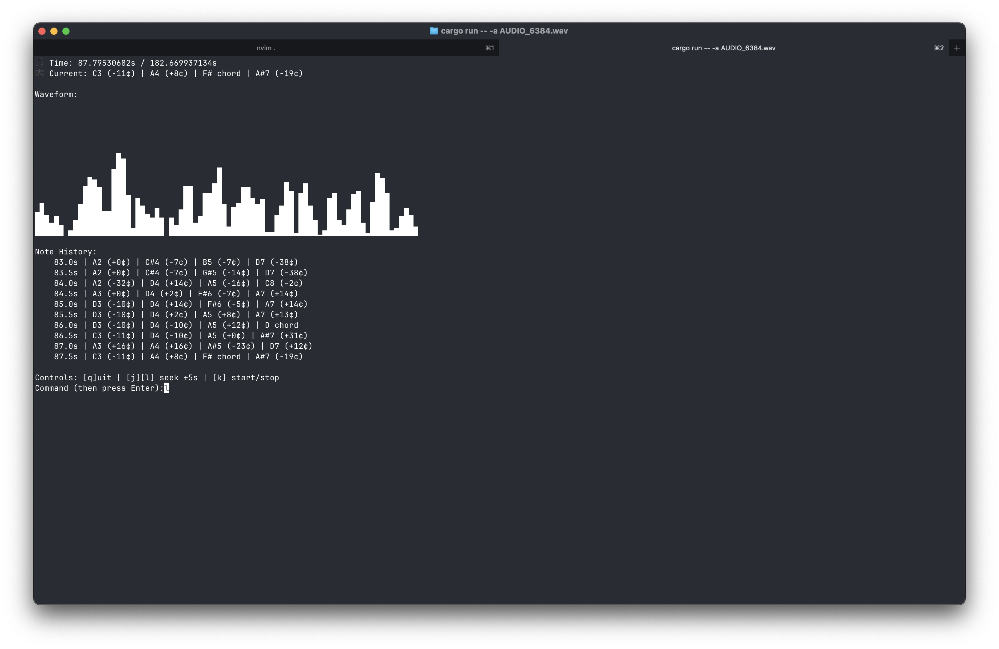

# like a crime



```pseudocode
(fast) fourier transform
over-engineered slop
```

## install dependencies

### clone repo

```
git clone git@github.com:calee14/like-a-crime.git
```

### install dependencies

```bash
cargo build
```

## usage

```bash
cargo run -- <your-audio-file>.wav

```

### build for release

```bash
cargo build --release

./target/release/like-a-crime <your-audio-file>.wav
```
